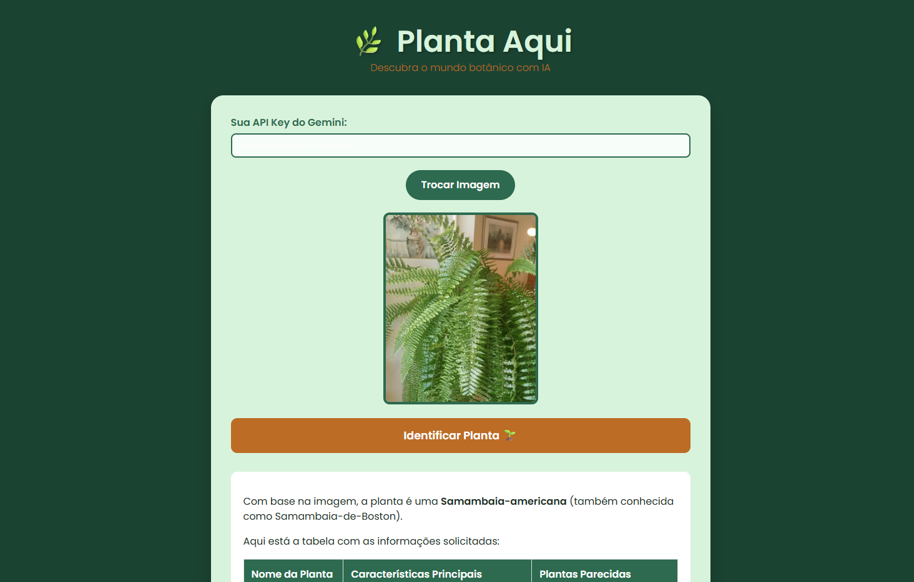

# 🌿 Planta Aqui — Identificação Botânica Inteligente

O **Planta Aqui** é uma aplicação web desenvolvida para entusiastas da botânica, jardineiros e curiosos que desejam **identificar plantas instantaneamente**. Através da tecnologia de **visão computacional do Google Gemini AI**, o site transforma uma simples foto em uma **ficha técnica completa**.

---

## ✨ O que ele entrega de valor?

Muitas vezes encontramos uma planta bonita em um parque ou queremos cuidar melhor de uma que ganhamos, mas não sabemos o nome ou suas necessidades. O **Planta Aqui** resolve isso de forma simples e intuitiva:

* **📸 Identificação Instantânea**
  Basta subir uma foto (PNG ou JPG) para descobrir a espécie da planta.

* **📋 Ficha Técnica Automatizada**
  Geração automática de uma tabela com:

  * Nome científico
  * Nome popular
  * Tipo de rega
  * Necessidade de sol
  * Tipo de solo

* **🌱 Sugestões Relacionadas**
  Indicação de plantas com estética ou cuidados similares, ajudando no planejamento do jardim.

* **🔐 Privacidade e Controle**
  O usuário utiliza **sua própria API Key**, garantindo autonomia e controle total sobre o uso da inteligência artificial.

---

## 🚀 Tecnologias Utilizadas

O projeto foi construído com ferramentas modernas para garantir **performance**, **escalabilidade** e uma **experiência de usuário fluida**:

| Tecnologia                  | Descrição                                                                   |
| --------------------------- | --------------------------------------------------------------------------- |
| **React + Vite**            | Framework base para uma interface reativa e carregamento ultra rápido       |
| **Google Gemini API**       | Inteligência Artificial multimodal para análise e reconhecimento de imagens |
| **CSS3 (Forest Aesthetic)** | Estilização personalizada com foco em uma paleta de cores orgânica          |
| **React Markdown**          | Renderização técnica das respostas da IA diretamente em formato de tabela   |

---

## 🎨 Interface

A interface foi projetada para ser **imersiva**, **leve** e **natural**, reforçando a conexão com o tema botânico:

* **🌳 Paleta de Cores**

  * Verde floresta: `#1b4332`
  * Verde folha: `#2d6a4f`
  * Marrom terra: `#bc6c25`

* **📱 Responsividade**
  O site se adapta perfeitamente a dispositivos móveis, permitindo tirar fotos pelo celular e identificar a planta na hora.

---

## 🛠️ Como rodar o projeto localmente

### 1️⃣ Clone o repositório

```bash
git clone https://github.com/seu-usuario/planta-aqui.git
```

### 2️⃣ Entre na pasta do projeto e instale as dependências

```bash
cd planta-aqui
npm install
```

### 3️⃣ Inicie o servidor de desenvolvimento

```bash
npm run dev
```

### 4️⃣ Configuração da API

Ao abrir o site, insira sua **API Key do Google AI Studio** no campo indicado na interface.

---

## 📝 Contribuições

Contribuições são muito bem-vindas! 💚
Sinta-se à vontade para:

* Abrir uma **Issue** com sugestões ou bugs
* Enviar um **Pull Request** com melhorias no design ou novas funcionalidades

---

## 🌿 Planta Aqui

Transformando curiosidade em conhecimento botânico, uma foto por vez.


